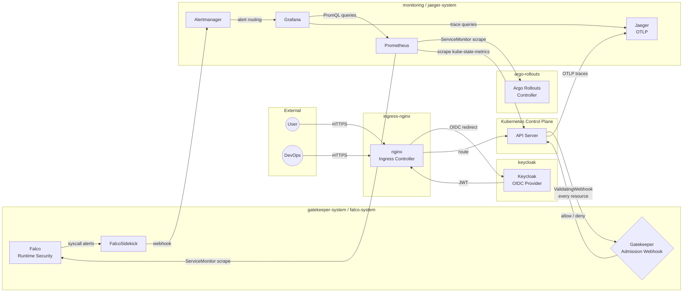
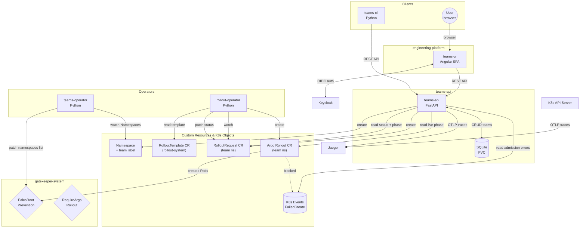

# Architecture

## 1. Infrastructure Components

```mermaid
flowchart LR
    subgraph ext["External"]
        User((User))
        DevOps((DevOps))
    end

    subgraph ingress_sg["ingress-nginx"]
        nginx["nginx\nIngress Controller"]
    end

    subgraph auth_sg["keycloak"]
        KC["Keycloak\nOIDC Provider"]
    end

    subgraph k8s_sg["Kubernetes Control Plane"]
        K8sAPI["API Server"]
    end

    subgraph security_sg["gatekeeper-system / falco-system"]
        GK{"Gatekeeper\nAdmission Webhook"}
        Falco["Falco\nRuntime Security"]
        FalcoSK["FalcoSidekick"]
    end

    subgraph delivery_sg["argo-rollouts"]
        Argo["Argo Rollouts\nController"]
    end

    subgraph obs_sg["monitoring / jaeger-system"]
        Prom["Prometheus"]
        AM["Alertmanager"]
        Grafana["Grafana"]
        Jaeger["Jaeger\nOTLP"]
    end

    User -->|HTTPS| nginx
    DevOps -->|HTTPS| nginx
    nginx -->|OIDC redirect| KC
    KC -->|JWT| nginx
    nginx -->|route| K8sAPI

    K8sAPI -->|ValidatingWebhook\nevery resource| GK
    GK -->|allow / deny| K8sAPI

    Falco -->|syscall alerts| FalcoSK
    FalcoSK -->|webhook| AM
    AM -->|alert routing| Grafana

    Prom -->|ServiceMonitor scrape| Argo
    Prom -->|ServiceMonitor scrape| Falco
    Prom -->|scrape kube-state-metrics| K8sAPI

    Grafana -->|PromQL queries| Prom
    Grafana -->|trace queries| Jaeger

    K8sAPI -->|OTLP traces| Jaeger
```

## 2. Application Layer

```mermaid
flowchart TB
    subgraph clients["Clients"]
        User((User\nbrowser))
        CLI["teams-cli\nPython"]
    end

    subgraph frontend["engineering-platform"]
        UI["teams-ui\nAngular SPA"]
    end

    subgraph backend["teams-api"]
        API["teams-api\nFastAPI"]
        DB[("SQLite\nPVC")]
    end

    subgraph operators["Operators"]
        TO["teams-operator\nPython"]
        RO["rollout-operator\nPython"]
    end

    subgraph resources["Custom Resources & K8s Objects"]
        NS["Namespace\n+ team label"]
        RT["RolloutTemplate CR\n(rollout-system)"]
        RR["RolloutRequest CR\n(team ns)"]
        AR["Argo Rollout CR\n(team ns)"]
        EV[("K8s Events\nFailedCreate")]
    end

    subgraph policy["gatekeeper-system"]
        FP{"FalcoRoot\nPrevention"}
        RP{"RequireArgo\nRollout"}
    end

    KC["Keycloak"]

    User -->|browser| UI
    UI <-->|OIDC auth| KC
    UI -->|REST API| API
    CLI -->|REST API| API

    API <-->|CRUD teams| DB
    API -->|create| NS
    API -->|create| RR
    API -->|read status + phase| RR
    API -->|read live phase| AR
    API -->|read admission errors| EV

    TO -->|watch Namespaces| NS
    TO -->|patch namespaces list| FP

    RO -->|watch| RR
    RO -->|read template| RT
    RO -->|create| AR
    RO -->|patch status| RR

    AR -->|creates Pods| FP
    AR -. blocked .-> EV

    K8sAPI["K8s API Server"] -->|OTLP traces| Jaeger["Jaeger"]
    API -->|OTLP traces| Jaeger
```
