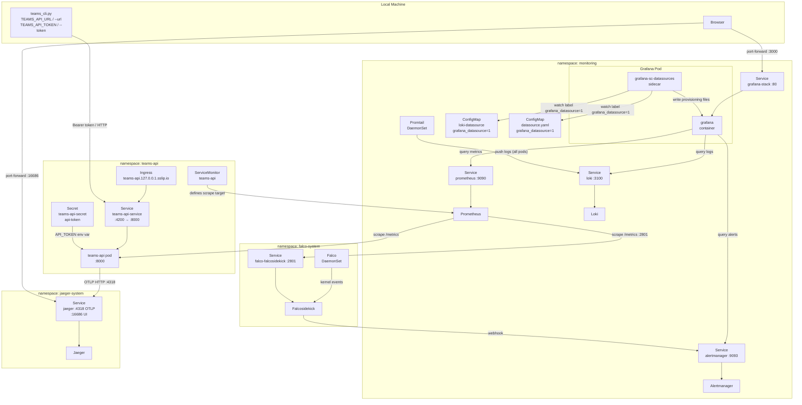

# Monitoring Architecture

```mermaid
flowchart TB
  subgraph local[Local Machine]
    CLI[teams_cli.py\nTEAMS_API_URL / --url\nTEAMS_API_TOKEN / --token]
    BROWSER[Browser]
  end

  subgraph teams_api_ns[namespace: teams-api]
    TAPI_SECRET[Secret\nteams-api-secret\napi-token]
    TAPI_SVC[Service\nteams-api-service\n:4200 → :8000]
    TAPI_ING[Ingress\nteams-api.127.0.0.1.sslip.io]
    TAPI_POD[teams-api pod\n:8000]
    TAPI_SM[ServiceMonitor\nteams-api]
  end

  subgraph monitoring_ns[namespace: monitoring]
    subgraph grafana_pod[Grafana Pod]
      GRAFANA[grafana\ncontainer]
      GRAFANA_SC[grafana-sc-datasources\nsidecar]
    end
    GRAFANA_SVC[Service\ngrafana-stack :80]
    CM_LOKI[ConfigMap\nloki-datasource\ngrafana_datasource=1]
    CM_DS[ConfigMap\ndatasource.yaml\ngrafana_datasource=1]
    PROM[Prometheus]
    PROM_SVC[Service\nprometheus :9090]
    AM[Alertmanager]
    AM_SVC[Service\nalertmanager :9093]
    LOKI[Loki]
    LOKI_SVC[Service\nloki :3100]
    PROMTAIL[Promtail\nDaemonSet]
  end

  subgraph jaeger_ns[namespace: jaeger-system]
    JAEGER[Jaeger]
    JAEGER_SVC[Service\njaeger :4318 OTLP\n:16686 UI]
  end

  subgraph falco_ns[namespace: falco-system]
    FALCO[Falco\nDaemonSet]
    FALCOSIDEKICK[Falcosidekick]
    FALCOSIDEKICK_SVC[Service\nfalco-falcosidekick :2801]
  end

  %% Local access via port-forward
  CLI -->|"Bearer token / HTTP"| TAPI_SVC
  BROWSER -->|port-forward :3000| GRAFANA_SVC
  BROWSER -->|port-forward :16686| JAEGER_SVC

  %% teams-api internals
  TAPI_SECRET -->|API_TOKEN env var| TAPI_POD
  TAPI_ING --> TAPI_SVC
  TAPI_SVC --> TAPI_POD

  %% Traces: teams-api → Jaeger
  TAPI_POD -->|"OTLP HTTP :4318"| JAEGER_SVC
  JAEGER_SVC --> JAEGER

  %% Metrics: Prometheus scrapes teams-api
  TAPI_SM -->|defines scrape target| PROM
  PROM -->|"scrape /metrics"| TAPI_POD
  PROM_SVC --> PROM

  %% Metrics: Prometheus scrapes Falcosidekick
  PROM -->|"scrape /metrics :2801"| FALCOSIDEKICK_SVC
  FALCOSIDEKICK_SVC --> FALCOSIDEKICK

  %% Falco → Falcosidekick → Alertmanager
  FALCO -->|kernel events| FALCOSIDEKICK
  FALCOSIDEKICK -->|webhook| AM_SVC
  AM_SVC --> AM

  %% Logs: Promtail → Loki
  PROMTAIL -->|"push logs (all pods)"| LOKI_SVC
  LOKI_SVC --> LOKI

  %% Grafana datasource provisioning
  GRAFANA_SC -->|"watch label grafana_datasource=1"| CM_LOKI
  GRAFANA_SC -->|"watch label grafana_datasource=1"| CM_DS
  GRAFANA_SC -->|write provisioning files| GRAFANA

  %% Grafana queries
  GRAFANA_SVC --> GRAFANA
  GRAFANA -->|query logs| LOKI_SVC
  GRAFANA -->|query metrics| PROM_SVC
  GRAFANA -->|query alerts| AM_SVC
```
